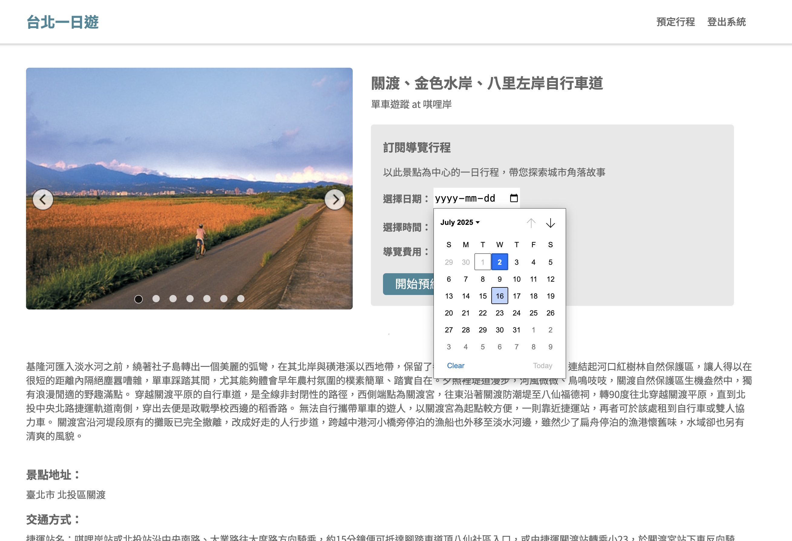

## Taipei-Day-Trip

**Taipei Day Trip** is an e-commerce project that incorporates third-party payment system, FastAPI back-end, and MySQL database. 

## Book Your Trip Now!
[Taipei Day Trip](http://35.94.253.126:8000/)

## The most popular destinations in Taipei right at your finger tip!
Find your next adventure from the top tourist attractions from our database

## Book your tour. It's that simple.
Visit the dedicated page for your preferred attractions. Learn more about them and get a preview of your trip. Once you are ready, simply book a trip on the same page.

## Tech Stack
**Front-End**
- JavaScript
- CSS

**Back-End**
- FastAPI
- PyJWT token encryption
- MySQL

**Cloud/Deployment**
- AWS EC2

## System Overview

- Built the front-end using only vanilla JavaScript and CSS
- Built the entire back-end with FastAPI with new features such as type annotation, query and path validation, Middleware
- Utilized PyJWT for token encryption
- Deployed on AWS EC2
- Incorporated third-party payment system, TapPay

## Tech Highlights
- Scroll-triggered loading: By utilizing the Intersection Observer API and a custom pagination function in the beck-end, the scroll to load animation effects were achieved without using any third party library.

<!-- - Database indexing: By implementing indexing in the MySQL database, we can improve the query performance. -->
